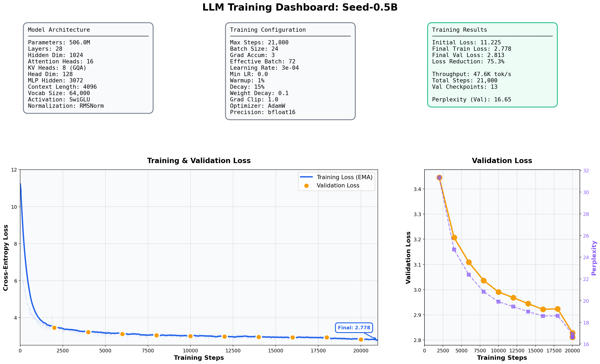

# LLM From Scratch

A 0.5B parameter decoder only dense transformer model trained on 10B tokens from FineWeb-Edu. Architecture inspired by Qwen3-0.6B one of the best small open models available.

[Get started](#get-started) · [Pretrained weights](https://huggingface.co/merterbak/Seed-0.5B)



## Overview

Model is a standard autoregressive decoder dense transformer: tokens are embedded, passed through 28 layers of attention and feedforward blocks, then projected to vocabulary logits to predict the next token. At inference time a KV cache is used so each generation step only processes the new token instead of the full context from scratch.

The goal of this project was to implement every piece from scratch (GQA, RoPE, SwiGLU, WSD schedule, KV cache) to fully understand how modern LLMs are built.

## Architecture

### Grouped Query Attention

In standard multi-head attention every query head has its own key and value projections, which means KV cache size scales with the number of heads. At long contexts this becomes a real memory bottleneck. Grouped Query Attention (GQA) solves this by having multiple query heads share a single K/V pair. The model retains full expressiveness on the query side while reducing cache memory.

This model uses 16 query heads and 8 KV heads each K/V pair is shared by 2 queries.

```
Queries:  [q0  q1] [q2  q3] ... [q14 q15]
               ↓       ↓              ↓
 KV pairs: [ kv0  ] [ kv1  ] ...  [ kv7  ]
```

RMSNorm is applied to every Q and K before the dot product. Without it, attention logits can blow up in magnitude and destabilize training and normalizing Q and K keeps dot products in a stable range throughout the run.

### RoPE

Traditional learned position embeddings assign a fixed vector to each position, so they can't generalize beyond the sequence lengths seen during training. Rotary Position Embeddings (RoPE) take a different approach: position is encoded as a rotation applied directly to the Q and K vectors before the dot product. Because the attention score ends up depending on the relative rotation between two positions rather than absolute indices, the model naturally handles relative distances.

RoPE theta is set to 1,000,000 a higher value spaces the frequency bands further apart, which helps the model attend over longer distances. YaRN and NTK scaling are also implemented so the effective context length can be extended at inference.

### SwiGLU

The feedforward network uses SwiGLU instead of a standard two layer ReLU MLP. The difference is an extra gating path: two parallel projections go up to the hidden dimension, one of them is passed through SiLU, and the two are multiplied element-wise before projecting back down. This gating mechanism lets the network learn which activations to suppress on a per element basis, making it more expressive per parameter than a plain MLP.

```
x → gate_proj → SiLU ─┐
x → up_proj   ────────× → down_proj → output
```

The hidden dimension expands from 1024 to 3072 (3×) inside the FFN.

### WSD Learning Rate Schedule

Cosine annealing starts reducing the learning rate almost immediately, which means the model spends a large fraction of training at a suboptimal LR.Warmup Stable Decay (WSD) schedule avoids this by holding  peak learning rate for the majority of training and only decaying it at the end.

The schedule has three phases. First a short linear warmup over the first 1% of steps. Then a long stable plateau at peak LR from step 1% all the way to 85%. Finally a linear decay down to 0 over the last 15% of steps.

Model keeps making meaningful progress throughout the stable phase, and the sharp decay at the end helps it converge cleanly.

## Get started

```bash
pip install -r requirements.txt
```

### 1. Prepare the dataset

Streams FineWeb-Edu from Hugging Face, trains a SentencePiece BPE tokenizer on the raw text, then tokenizes everything into sharded `.npy` files.

```bash
python prepare.py
```

### 2. Train

```bash
python train.py --batch_size 16 --gradient_accumulation_steps 2
```

Supported commands (other parameters can change inside of file):
- `--batch_size`
- `--gradient_accumulation_steps`
- `--no-compile` (disables `torch.compile`
- `--resume_path PATH`
- `--init_from scratch`(or `resume` if path isn't changed)

### 3. Generate

Edit the prompt and sampling parameters at the top of `inference.py`, then run:

```bash
python inference.py
```

